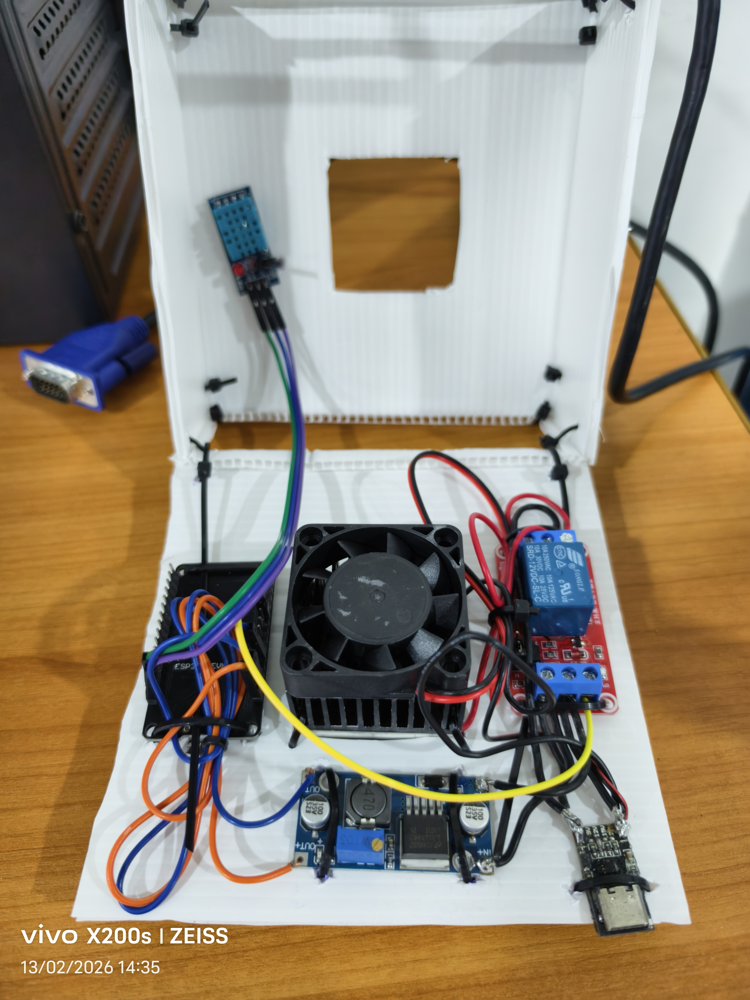
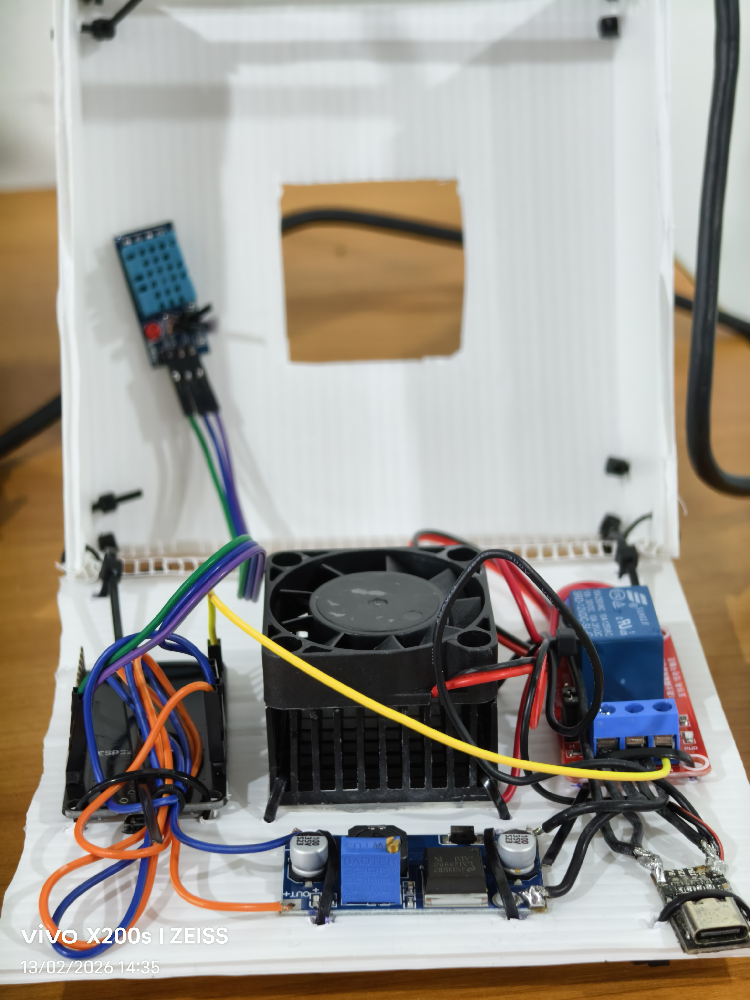
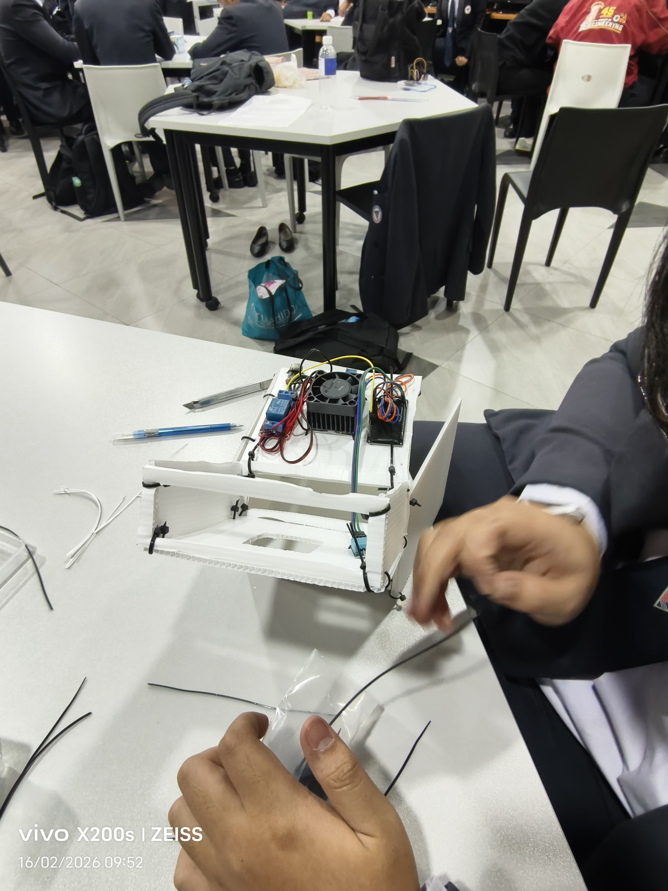
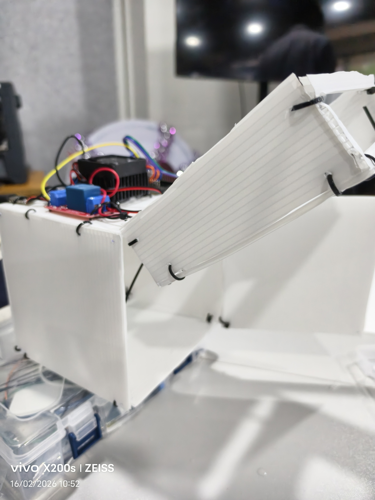
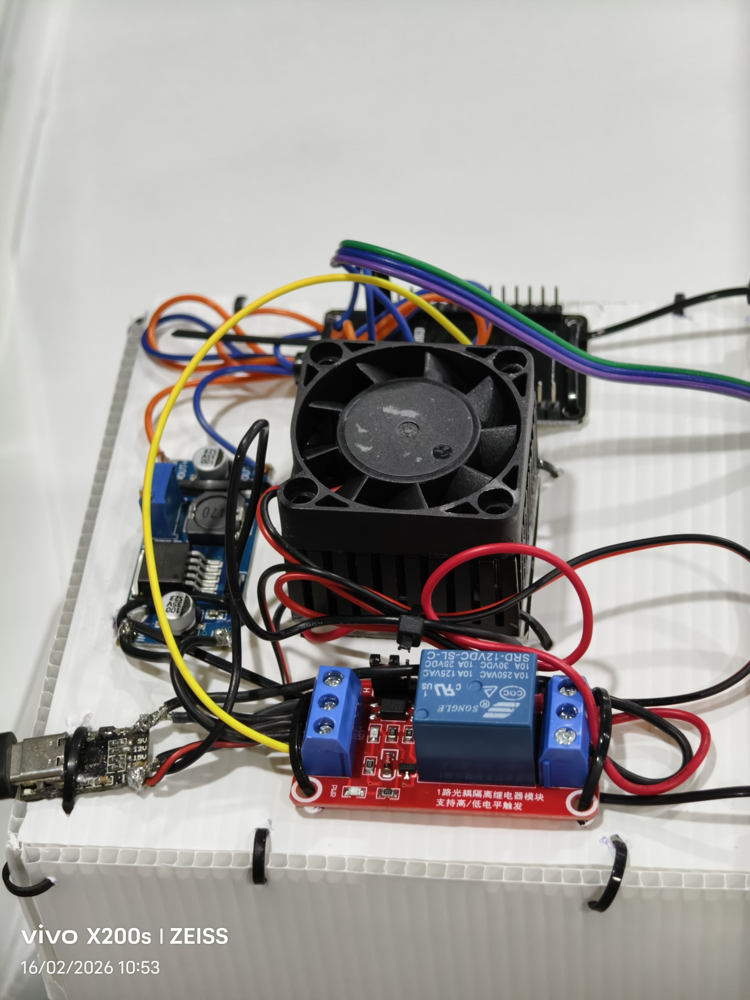

# เครื่องดักความชื้น

## คำอธิบายโดยย่อ
โค้ดนี้คือโปรแกรมสำหรับบอร์ด **ESP32** หรือ **ESP8266** (ไมโครคอนโทรลเลอร์ที่มี WiFi) ที่ออกแบบมาเพื่อควบคุมพัดลมหรืออุปกรณ์อื่น ๆ ผ่านรีเลย์ โดยอ่านค่าความชื้นจากเซ็นเซอร์ **DHT11** และรับคำสั่ง/ส่งสถานะผ่าน **Discord** (Bot)

---

## ส่วนต่าง ๆ ของโค้ด

### 1. การนำเข้าไลบรารีและการกำหนดค่าเริ่มต้น (Includes & Configuration)
- นำเข้าไลบรารีสำหรับ:
  - WiFi, HTTP/HTTPS (สำหรับเชื่อมต่อ Discord)
  - WiFiManager (สำหรับตั้งค่า WiFi อัตโนมัติ)
  - ArduinoJson (จัดการ JSON)
  - DHT (เซนเซอร์ความชื้น/อุณหภูมิ DHT11)
- ใช้ `#ifdef` เพื่อเลือกไลบรารีที่เหมาะสมสำหรับ ESP32 / ESP8266

**ค่ากำหนดสำคัญ**
- `RELAY_PIN` (32) — ขา GPIO ที่เชื่อมกับรีเลย์สำหรับควบคุมพัดลม (Active LOW: LOW = ON, HIGH = OFF)
- `DHTPIN` (14), `DHTTYPE` (DHT11) — ขา GPIO และชนิดเซนเซอร์ DHT

**Discord Configuration**
- `discord_token` — วาง Token ของ Discord bot
- `channel_id` — วาง Discord Channel ID
- `mentor_user_id` — (ถ้ามี) ID ของผู้รับแจ้งเตือน

---

### 2. ตัวแปรสถานะและเวลา (State & Timing Variables)

**State Variables**
- `fanState`: สถานะพัดลมที่ต้องการ (true/false) — ใช้ทั้งโหมด Manual หรือ Auto
- `autoMode`: โหมดอัตโนมัติ (ควบคุมด้วยความชื้น)
- `overheatMode`: โหมดป้องกันความร้อนสูง (Overheat Protection)
- `lastMessageId`: เก็บ ID ข้อความ Discord ล่าสุดเพื่อป้องกันการประมวลผลซ้ำ

**Timing Variables**
- `discordInterval` = 3000 ms (3 วินาที) — ตรวจสอบคำสั่งจาก Discord
- `autoInterval` = 2000 ms (2 วินาที) — ตรวจสอบค่าความชื้นสำหรับ Auto Mode

**Overheat Protection (Duty Cycle)**
- `MAX_RUN_TIME` = 600000 ms = 10 นาที — เวลาสูงสุดที่พัดลมสามารถทำงานต่อเนื่องได้
- `REST_TIME` = 60000 ms = 1 นาที — เวลาพักเมื่อเข้าสถานะพัก (force OFF)

---

### 3. ฟังก์ชันสื่อสารกับ Discord (Discord Communication Functions)

#### `sendDiscordMessage(String message)`
- ใช้ HTTP POST ส่งข้อความไปยัง Discord channel ที่กำหนด
- ตรวจสอบสถานะ WiFi ก่อนส่ง
- ใช้ `WiFiClientSecure` + `client.setInsecure()` (ไม่ปลอดภัยในเชิงความมั่นคง)
- สร้าง payload เป็น JSON ด้วย `StaticJsonDocument` แล้ว `serializeJson`

#### `checkDiscordCommands()`
- ใช้ HTTP GET ดึงข้อความล่าสุดจาก Discord (`limit=1`)
- ตรวจสอบ `msgId` ว่าแตกต่างจาก `lastMessageId` หรือไม่
- รองรับคำสั่ง:
  - `!status` — ตอบสถานะระบบ (ความชื้น, Auto Mode, Overheat, Fan)
  - `!auto on` / `!auto off` — เปิด/ปิด Auto Mode
  - `!overheat on` / `!overheat off` — เปิด/ปิด Overheat Protection
  - `!fan on` / `!fan off` — ควบคุมพัดลมแบบ Manual (ใช้ได้เมื่อ `autoMode` = OFF)

---

### 4. ฟังก์ชันควบคุมพัดลม (`runFanLogic`)
- ทำหน้าที่กำหนดสถานะสุดท้ายของรีเลย์ (พัดลม)
- **Auto Mode Logic**:
  - เมื่อ `autoMode` = ON จะอ่านค่าความชื้นทุก `autoInterval`
  - หากความชื้น > 60.0% → สั่งพัดลม ON
  - มิฉะนั้น → OFF
- **Overheat Protection Logic (Duty Cycle)**:
  - หากพัดลมถูกสั่ง ON และ `overheatMode` = ON:
    - หากทำงานต่อเนื่องครบ `MAX_RUN_TIME` → สลับเป็นพัก (`isResting = true`) และ force OFF เป็นเวลา `REST_TIME`
    - เมื่อพักครบ → กลับมาทำงานต่อ
  - หากพัดลม OFF หรือ `overheatMode` = OFF → รีเซ็ตสถานะป้องกันความร้อน
- **Hardware Actuation**:
  - รีเลย์เป็น Active LOW: ใช้ `digitalWrite(RELAY_PIN, finalRelayState ? LOW : HIGH);`

---

### 5. ฟังก์ชัน `setup()` และ `loop()`
- `setup()`:
  - เริ่ม Serial
  - ตั้ง `RELAY_PIN` เป็น OUTPUT และเซ็ต HIGH (พัดลม OFF)
  - เริ่ม DHT sensor
  - ใช้ `WiFiManager` เพื่อเชื่อม WiFi อัตโนมัติ (สร้าง AP หากยังไม่เคยเชื่อม)
  - ส่งข้อความ "System Online" ไปยัง Discord
- `loop()`:
  - เรียก `runFanLogic()` เป็นระยะ
  - ตรวจสอบ `checkDiscordCommands()` ทุก `discordInterval`

---






## โค้ด (เต็ม)
```cpp
#ifdef ESP32
 #include <WiFi.h>
 #include <HTTPClient.h>
 #include <WiFiClientSecure.h>
#elif defined(ESP8266)
 #include <ESP8266WiFi.h>
 #include <ESP8266HTTPClient.h>
 #include <WiFiClientSecure.h>
#endif

#include <WiFiManager.h>
#include <ArduinoJson.h>
#include "DHT.h"

// --- Configuration ---
#define RELAY_PIN 32
#define DHTPIN 14
#define DHTTYPE DHT11

// Discord Configuration
const char* discord_token = "วาง Token Discord bot";
const char* channel_id = "วาง Discord Channel ID";
const char* mentor_user_id = "วาง ID ของคนที่เป็นเจ้าของสำหรับแจ้งเตือน";

DHT dht(DHTPIN, DHTTYPE);

// --- State Variables ---
bool fanState = false;          // Desired Fan State (Manual or Auto decision)
bool autoMode = false;          // Auto Mode (Humidity Control)
bool overheatMode = false;      // Overheat Protection Mode
String lastMessageId = "";

// --- Timing Variables ---
unsigned long lastDiscordCheck = 0;
const long discordInterval = 3000;

// Overheat Protection Variables
unsigned long currentRunStartTime = 0;
bool isResting = false;
unsigned long restStartTime = 0;
const unsigned long MAX_RUN_TIME = 600000; // 10 minutes
const unsigned long REST_TIME = 60000;     // 1 minute

// Auto Mode Timer
unsigned long lastAutoCheck = 0;
const long autoInterval = 2000;

void sendDiscordMessage(String message) {
 if (WiFi.status() != WL_CONNECTED) return;
 HTTPClient http;
 WiFiClientSecure client;
 client.setInsecure();
 if (http.begin(client, String("https://discord.com/api/v10/channels/") + channel_id + "/messages")) {
   http.addHeader("Authorization", String("Bot ") + discord_token);
   http.addHeader("Content-Type", "application/json");
   StaticJsonDocument<512> doc;
   doc["content"] = message;
   String jsonBody;
   serializeJson(doc, jsonBody);
   int httpCode = http.POST(jsonBody);
   if (httpCode > 0) Serial.printf("[Discord] Sent: %d\n", httpCode);
   else Serial.printf("[Discord] Error: %s\n", http.errorToString(httpCode).c_str());
   http.end();
 }
}

void checkDiscordCommands() {
 if (WiFi.status() != WL_CONNECTED) return;
 HTTPClient http;
 WiFiClientSecure client;
 client.setInsecure();
  if (http.begin(client, String("https://discord.com/api/v10/channels/") + channel_id + "/messages?limit=1")) {
   http.addHeader("Authorization", String("Bot ") + discord_token);
   int httpCode = http.GET();
   if (httpCode == 200) {
     String payload = http.getString();
     DynamicJsonDocument doc(2048);
     DeserializationError error = deserializeJson(doc, payload);
     if (!error && doc.size() > 0) {
       String msgContent = doc[0]["content"].as<String>();
       String msgId = doc[0]["id"].as<String>();
      
       if (msgId != lastMessageId) {
         lastMessageId = msgId;
         msgContent.toLowerCase();
         Serial.println("[Discord] Cmd: " + msgContent);

         if (msgContent.indexOf("!status") >= 0) {
            float h = dht.readHumidity();
            String statusMsg = "📊 **System Status**\n";
            statusMsg += "🌡️ Humidity: **" + String(h, 1) + "%**\n";
            statusMsg += "🤖 Auto Mode: **" + String(autoMode ? "ON" : "OFF") + "**\n";
            statusMsg += "🛡️ Overheat Protection: **" + String(overheatMode ? "ON" : "OFF") + "**\n";
            statusMsg += "❄️ Fan State: **" + String(digitalRead(RELAY_PIN) == LOW ? "ON" : "OFF") + "**";
            if (overheatMode && isResting) statusMsg += " (recovering...)";
            sendDiscordMessage(statusMsg);
         }
         else if (msgContent.indexOf("!auto on") >= 0) {
           autoMode = true;
           sendDiscordMessage("🤖 Auto Mode: **ON** (Fan controlled by humidity > 60%)");
         }
         else if (msgContent.indexOf("!auto off") >= 0) {
           autoMode = false;
           sendDiscordMessage("🤖 Auto Mode: **OFF** (Manual control enabled)");
         }
         else if (msgContent.indexOf("!overheat on") >= 0) {
           overheatMode = true;
           currentRunStartTime = millis(); // Reset timer
           isResting = false;
           sendDiscordMessage("🛡️ Overheat Protection: **ON** (10m ON / 1m OFF cycle enabled)");
         }
         else if (msgContent.indexOf("!overheat off") >= 0) {
           overheatMode = false;
           isResting = false;
           sendDiscordMessage("'️ Overheat Protection: **OFF**");
         }
         else if (msgContent.indexOf("!fan on") >= 0) {
           if (autoMode) {
              sendDiscordMessage("⚠️ Cannot manually control fan while **Auto Mode** is ON. Disable auto mode first (!auto off).");
           } else {
              fanState = true;
              sendDiscordMessage("✅ Manual Fan: **ON**");
           }
         }
         else if (msgContent.indexOf("!fan off") >= 0) {
           if (autoMode) {
              sendDiscordMessage("⚠️ Cannot manually control fan while **Auto Mode** is ON. Disable auto mode first (!auto off).");
           } else {
              fanState = false;
              sendDiscordMessage("🛑 Manual Fan: **OFF**");
           }
         }
       }
     }
   }
   http.end();
 }
}

void runFanLogic() {
 // 1. Determine Desired State
 bool desiredState = fanState;

 // Auto Mode Logic
 if (autoMode) {
   if (millis() - lastAutoCheck > autoInterval) {
     lastAutoCheck = millis();
     float h = dht.readHumidity();
     if (!isnan(h)) {
       if (h > 60.0) {
          desiredState = true;
          // If we just switched to ON from OFF in auto mode
          if (!fanState) {
            fanState = true;
            // Optional: Notify? sendDiscordMessage("💧 Humidity > 60%. Auto Fast Start.");
          }
       } else {
          desiredState = false;
          if (fanState) { fanState = false; }
       }
     }
   }
   desiredState = fanState; // Sync local var
 }

 // 2. Apply Overheat Protection Logic (Duty Cycle)
 bool finalRelayState = desiredState; // True = ON (LOW)

 if (desiredState && overheatMode) {
   unsigned long now = millis();
   if (!isResting) {
      if (now - currentRunStartTime >= MAX_RUN_TIME) {
         isResting = true;
         restStartTime = now;
         finalRelayState = false; // Force OFF
         sendDiscordMessage("🛡️ Overheat Protection: Resting for 1 minute...");
      }
   } else {
      if (now - restStartTime >= REST_TIME) {
         isResting = false;
         currentRunStartTime = now;
         finalRelayState = true; // Resume ON
         sendDiscordMessage("🛡️ Overheat Protection: Resuming operation.");
      } else {
         finalRelayState = false; // Keep OFF
      }
   }
 } else {
   // If fan is OFF or Overheat protection disabled, reset protection state
   if (!desiredState) {
      currentRunStartTime = millis();
      isResting = false;
   }
 }

 // 3. Hardware Actuation
 // Relay is Active LOW (LOW = ON, HIGH = OFF)
 digitalWrite(RELAY_PIN, finalRelayState ? LOW : HIGH);
}

void setup() {
 Serial.begin(115200);
 pinMode(RELAY_PIN, OUTPUT);
 digitalWrite(RELAY_PIN, HIGH); // Default OFF
 dht.begin();
 WiFiManager wm;
 if (!wm.autoConnect("ESP32_Peltier_Control")) ESP.restart();
 Serial.println("Ready!");
 sendDiscordMessage("🤖 System Online. waiting for commands...");
}

void loop() {
 runFanLogic();
 if (millis() - lastDiscordCheck > discordInterval) {
   lastDiscordCheck = millis();
   checkDiscordCommands();
 }
}
